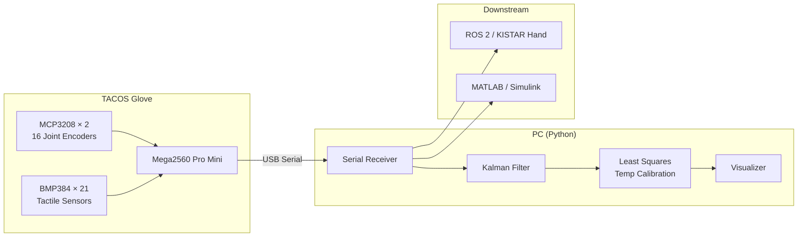

# TACOS Glove

**TACOS** — **T**actile **A**ugmented **C**ontrol & **O**ptimization **S**ystem

손가락 관절 각도(16 DOF)와 21채널 BMP384 촉각 센서를 통합한 데이터 글러브 프로젝트입니다.  
펌웨어 → PC 수신 → 온도 drift 보정 → 로봇 손(KISTAR Hand 등) 제어까지의 파이프라인을 구축합니다.

---

## 주요 기능

| 구분 | 내용 |
|------|------|
| **관절** | MCP3208 ADC × 2 → 16채널 포텐셜미터, 선형 매핑 후 0~4096 / ±4096 출력 |
| **촉각** | BMP384 × 21 (SPI), 부팅 offset + 온도 최소제곱 보정 |
| **통합** | 관절 16 + 촉각 21 = **37값 CSV** 실시간 스트리밍 |
| **PC** | Python 수신·Kalman·시각화·MATLAB 연동 |

---

## 시스템 구성



---

## 하드웨어

| 부품 | 역할 | 비고 |
|------|------|------|
| **Arduino Mega2560 Pro Mini** | 메인 MCU | `3_Mega2560Pro_mini/ljs/` |
| **MCP3208 × 2** | 12-bit SPI ADC | CS 핀 44, 46 — 16채널 관절 |
| **BMP384 × 21** | 압력·온도 센서 | CS 핀 8~28 (신보드) |
| **포텐셜미터** | 관절 각도 | A0~A11 (캘리브레이션용) |
| Arduino Mega / Teensy 4.0 | 초기 프로토타입 | `2_Arduino Mega/`, `1_Teensy4_0/` |

### 손가락·링크 매핑 (16 DOF)

| 손가락 | Link | 채널 | 설명 |
|--------|------|------|------|
| Thumb | L0~L3 | 0~3 | Flexion + Rotation |
| Index | L4~L7 | 4~7 | L4: Spread (±45°) |
| Middle | L8~L11 | 8~11 | L8: Spread (±45°) |
| Ring | L12~L15 | 12~15 | L12: Spread (±45°) |

### 촉각 센서 배치 (21채널)

손가락당 3~4개 BMP384 셀 — MCP(메타카arpophalangeal), PIP, DIP 등 관절 부위에 부착.

> **알려진 하드웨어 이슈:** 센서 #6(검지 MCP1) 불량, #9(중지 PIP) 플라스틱 교체 필요, 새끼손가락 유격 과다.  
> 자세한 내용은 [`5_TACOS_Glove/ljs/ReadMe.txt`](5_TACOS_Glove/ljs/ReadMe.txt) 참고.

---

## 빠른 시작

### 1. 라이브러리 경로

각 `.ino` 스케치 폴더에 `src/` 디렉터리를 두고 SparkFun BMP384 라이브러리를 포함합니다.

```c
#include "src/SparkFun_BMP384_Arduino_Library/src/SparkFunBMP384.h"
```

공용 라이브러리 원본: [`lib/origin/SparkFun_BMP384_Arduino_Library/`](lib/origin/SparkFun_BMP384_Arduino_Library/)

### 2. 촉각만 확인 (가장 간단)

```
펌웨어: 3_Mega2560Pro_mini/ljs/8_tactile_only/8_tactile_only.ino
→ 시리얼 모니터 (1 Mbps)에서 [v1, v2, ..., v21] 출력 확인
```

### 3. 통합 글러브 (관절 + 촉각) — **최신 파이프라인**

```
펌웨어: 3_Mega2560Pro_mini/ljs/7_encoder_tactile/20260215_encoder_tactile/
PC:     0_pc_receiver/ljs/encoder_tactile_receiver.py  (COM 포트 수정)
```

출력 예시 (37값 CSV, 115200 baud):

```
3355,490,...,1566,226.48,255.96,...,50.52
↑ joint 16개                    ↑ tactile 21개 (Pa, offset 기준)
```

### 4. 관절만 (ROS 2 등)

```
펌웨어: 5_TACOS_Glove/ljs/TACOS_Glove_OUT_DATA/TACOS_Glove_OUT_DATA.ino
출력:   val0,val1,...,val15  (115200 baud, ~100 Hz)
```

### 5. 고속 촉각 수집 + 온도 보정

```
펌웨어: 3_Mega2560Pro_mini/ljs/4_tactile_MegaPM_temp/
PC:     main_1 → main_3_1 → main_4_2  (0_pc_receiver/ljs/)
```

---

## 데이터 프로토콜 요약

| 프로토콜 | STX / 형식 | Baud | 용도 |
|----------|-----------|------|------|
| **통합 CSV** | 37값 콤마 구분 | 115200 | `7_encoder_tactile` |
| **관절 CSV** | 16값 콤마 구분 | 115200 | `TACOS_Glove_OUT_DATA` |
| **바이너리 v4** | STX `0xFFAA`, 133B (pres+temp×21) | 1 Mbps | `4_tactile`, PC `tactile_serial.py` |
| **바이너리 v1~3** | STX `0xA5`, int16×21 | 115200~1M | 초기 프로토타입 |
| **텍스트 촉각** | `[v1, v2, ..., v21]` | 1 Mbps | `5_tactile`, `8_tactile_only` |

상세 스펙: [`docs/EXPERIMENTS.md`](docs/EXPERIMENTS.md)

---

## 프로젝트 구조

```
TACOS_Glove/
├── 0_pc_receiver/          # PC 수신·처리 (Python)
│   ├── ljs/                  #   최신 PC 파이프라인
│   └── kyc/                  #   초기 버전
├── 1_Teensy4_0/            # Teensy 4.0 초기 BMP384 테스트
├── 2_Arduino Mega/         # Arduino Mega 프로토타입
├── 3_Mega2560Pro_mini/     # ★ 메인 MCU 펌웨어 (ljs/)
│   └── ljs/
│       ├── 1~4_tactile_*     #   촉각 프로토콜 진화 (v1→v4)
│       ├── 5_tactile_*       #   촉각 텍스트 디버그
│       ├── 6_tactile_*       #   재료별 촉각 실험
│       ├── 7_encoder_tactile #   ★ 통합 (관절+촉각) — 최신
│       └── 8_tactile_only    #   촉각 단독
├── 4_MATLAB/               # MATLAB/Simulink 실험 노트
├── 5_TACOS_Glove/          # ★ 글러브 관절·캘리브레이션
│   └── ljs/
│       ├── TACOS_Glove_OUT_DATA/   # ROS 2용 관절 출력
│       ├── 01_Glove_Calibration/   # ADC 캘리브레이션
│       └── Encoder_EXP/            # 엔코더 실험
├── lib/                    # 공용 BMP384 라이브러리
└── docs/                   # 실험·프로토콜 상세 문서
```

> `ljs/` — 최신 작업본 / `kyc/` — 초기·공유 버전

---

## 최근 작업 (2026-02)

| 날짜 | 내용 |
|------|------|
| **2026-02-15** | `20260215_encoder_tactile.ino` — MCP3208 16관절 + BMP384 21채널 통합, 센서 재연결 로직 |
| **2026-02-04** | 관절 캘리브레이션 데이터 갱신 (`20260204_calibration_data.txt`) |
| **2026-02** | Index L5 `IN_START[5]`: 2385 → **1900** 수정 (`TACOS_Glove_OUT_DATA`, `7_encoder_tactile`) |

---

## PC 수신 스크립트 (`0_pc_receiver/ljs/`)

| 스크립트 | 역할 |
|----------|------|
| `encoder_tactile_receiver.py` | 통합 글러브 37값 수신, tactile delta → joint 보정 |
| `main_1_data_collect_save_show.py` | 실시간 수집 + Kalman + 저장 + 시각화 |
| `main_3_1_data_load_fitting_save_show.py` | 온도-압력 최소제곱 fitting → 계수 저장 |
| `main_4_2_apply_calib_data_save_show.py` | 보정 적용 실시간 수집 |
| `main_6_only_one_data.py` | 1채널 → MATLAB 가상 COM 전송 |
| `Tactile/Serial/tactile_serial.py` | 0xFFAA 바이너리 패킷 파서 |

실행 위치: `0_pc_receiver/ljs/` (작업 디렉터리 기준 `sys.path` 설정)

```bash
cd 0_pc_receiver/ljs
python encoder_tactile_receiver.py
```

---

## 캘리브레이션

### 관절 (MCP3208)

1. `5_TACOS_Glove/ljs/01_Glove_Calibration/calibration_Code/` 업로드
2. 각 링크를 ±90° / ±45°로 움직이며 ADC raw 기록
3. `IN_START[]`, `IN_END[]` → `OUT_START[]`, `OUT_END[]` 선형 매핑 테이블에 반영

참고 데이터: [`5_TACOS_Glove/ljs/20260204_calibration_data.txt`](5_TACOS_Glove/ljs/20260204_calibration_data.txt)

### 촉각 (BMP384)

1. **부팅 offset** — setup에서 무하중 pressure 저장
2. **온도 drift 보정** — `pres ≈ a·temp + b` 채널별 최소제곱 (`main_3_1`)
3. **실시간 적용** — `pres_calib = pres - (a·temp + b)` (`main_4_2`)

---

## PC 수신 출력 예시 (구형 프로토콜 STX=0xA5)

```
Serial port COM10 opened successfully.
STX=0xa5, t_us=144372, count=21, vals=[-2, -6, -6, -5, -5, -7, -4, -2, -2, -7, -2, -6, -6, -4, -1, 0, -2, -3, -2, -2, -2]
STX=0xa5, t_us=242484, count=21, vals=[-5, -15, -17, -14, -13, -16, -11, -7, -6, -15, -5, -16, -14, -6, -2, -2, -4, -4, -4, -4, -4]
```

---

## 문서

- [실험·코드 상세 가이드](docs/EXPERIMENTS.md) — 펌웨어 진화, 글러브 코드, PC 파이프라인, MATLAB 실험

---

## 라이선스

본 프로젝트는 [BSD 3-Clause License](LICENSE) 하에 배포됩니다.

서드파티 라이브러리는 각자의 라이선스를 따릅니다.

- [SparkFun BMP384 Arduino Library](lib/origin/SparkFun_BMP384_Arduino_Library/) — 별도 LICENSE 포함
